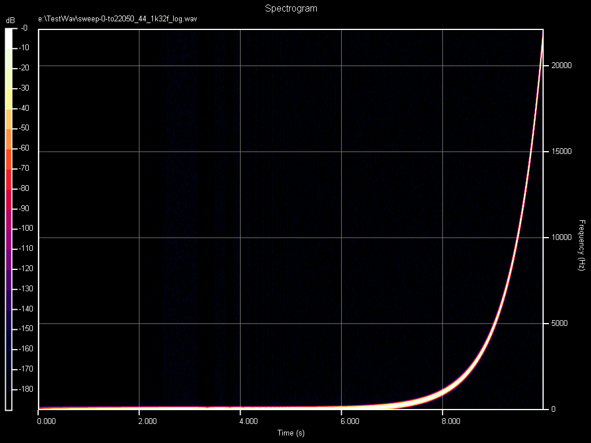
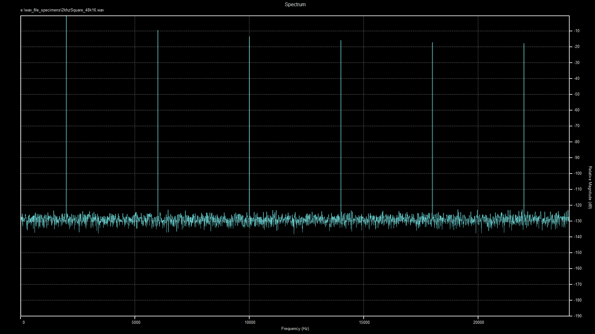

# sndspec
*soundfile-to-spectrogram / spectrum utility*

*above: spectrogram showing 0-22050 Hz frequency sweep*

*above: frequency spectrum of 2khz square wave*

### usage

**sndspec filename [filename2 ...] [options]**

~~~
Usage: sndspec filename [filename2 ...] [options]

--dyn-range <n>                                   Set Dynamic Range in dB
-o, --output-dir <path>                           Set Output directory
-h, --height <n>                                  Set Image Height in Pixels
-w, --width <n>                                   Set Image Width in Pixels
-t, --time-range <start-time> <finish-time>       Set Time Range in seconds
--white-background                                White Background (instead of black) with inverted colours 
-W, --window <name>                               Set the window function
--show-windows                                    Show a list of available window functions
--spectrum                                        Plot a Spectrum instead of Spectrogram
-S, --smoothing <moving average|peak|none>        Set Spectrum Smoothing Mode (default:peak)
-c, --channel <[all|[L|R|0|1|2|...]...] [sum|difference|normal]> select specific channels and set channel mode
-r, --recursive                                   Recursive directory traversal
--help                                            Help
~~~

### notes

- input filenames can be either directories or files. If they are directories, all suitable files within them are processed. Combinations of files and directories are ok. 
- if recursive directory traversal is enabled, directories within directories will also be processed
- case and punctuation of window names is ignored. Kaiser window is the default, and it is tuned to the requested dynamic-range
- output filename is input filename with .png extension
- when plotting a *spectrum*, a single FFT is performed, so the time range must be reasonable to prevent FFT being too large. (Therefore, don't forget to put in a sensible time range to ensure the FFT is not too large)
- if you want to plot the frequency response of an impulse response, you might want to switch-off the default Kaiser Window, by using **-W rectangular**, particularly if your impulse response is asymmetrical,
as the window might skew your results in an undesirable way.
- when specifying channels with the **--channel** option, the left channel is 0 and the right is 1. Channels always start at zero.
- The default channel setting is all channels / normal mode

### motivation and design goals

Having used the [spectrogram tool](http://www.mega-nerd.com/libsndfile/tools/#spectrogram) from [sndfile-tools](http://www.mega-nerd.com/libsndfile/tools) for testing [ReSampler](https://github.com/jniemann66/ReSampler) for some time,
I wanted to improve upon the method of generating spectrograms (and spectrums) in the following ways:

- **directory traversal** : allows processing a whole directory (and subdirectories, if desired) of sound files without having to rely on scripts
- **speed** : by processing sound files in batches, the overhead of starting up the program and initializing resources can be done just once, thereby saving a lot of processing time
- **ability to plot spectrums** (in addition to spectrograms)
- **ability to choose from a variety of window functions**
- **core functions in a library component**, to be used in other future software projects
- **potential quad-precision (or long double)** implementations
- **potential customisation of color palettes** and targeting of paper formats as well as screen
- **potential plotting of [cepstrums](https://en.wikipedia.org/wiki/Cepstrum)** and other types of transforms / plots

Although the produced plots bear a strong resemblance to those produced by the sndfile-tools spectrogram program,
the code for sndspec is entirely original.

### compiling
~~~
#install dependencies
sudo apt install libsndfile-dev
sudo apt install libfftw3-dev
sudo apt install libcairo-dev

#build
cd directory-of-your-choice
cmake path-to-sndspec-source
make
~~~

#### notes

this project requires C++17 or higher. (gcc &gt;= 8 / Clang &gt;= 7)

on *nix systems, the libraries are usually placed in standard places, eg(on Ubuntu): /usr/lib/x86_64-linux-gnu/libsndfile.so /usr/lib/x86_64-linux-gnu/libfftw3.so /usr/lib/x86_64-linux-gnu/libcairo.so

for Windows, the relevant dlls are placed in subdirectories of the project directory

Also for Windows, I haven't bothered to do a MSVC build, preferring to just use [mingw-w64](http://mingw-w64.org). If anyone really wants an MSVC version then let me know, or better yet -  just add the relevant cmake code :-)

#### known compiling problems
if you get an error like this (from the linker) on Linux:
~~~
error: /usr/local/lib/libfftw3.a(apiplan.o): relocation R_X86_64_32S against `.rodata' can not be used when making a PIE object; recompile with -fPIC
~~~
... it means that the linker is trying to link to the static version (.a) of libfftw3, probably because it can't find the shared (.so) version.
Find where libfftw3.so is installed, and set the find_libary() hints in CMakeLists.txt accordingly.
(Also, Remember that Cmake stores these variables, so clear the cmake configuration after making a change before running cmake)

### todo

- info, metadata
- channel sum / difference
- multichannel spectrograms
- Quadmath
- long double
- waveforms
- other color palettes
- log frequency scale

#### completed

~~channel selection~~

~~smoothing of spectrum data~~

~~spectrums~~

~~grid, tickmarks - frequency axis~~

~~tickmarks - time axis~~

~~heat map legend~~

~~axis labels~~

~~heading~~

~~Output directory selection~~

~~input range selection~~

~~white background option~~

~~directory traversal~~

~~Window function selection~~
